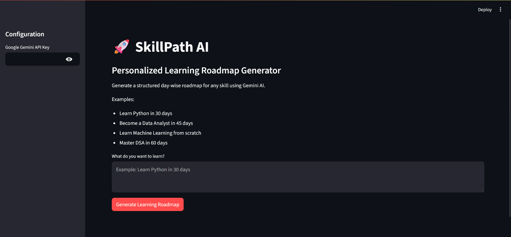
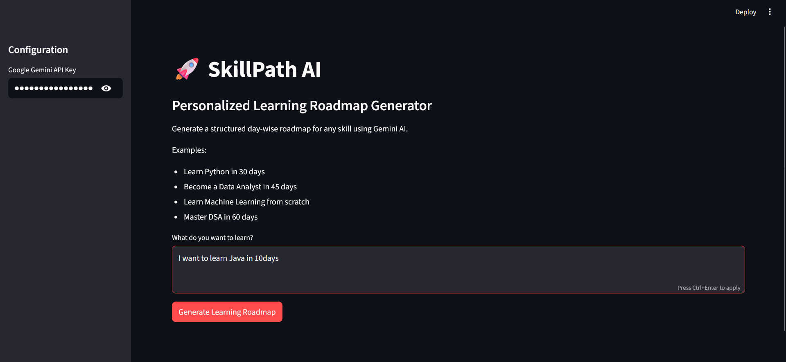
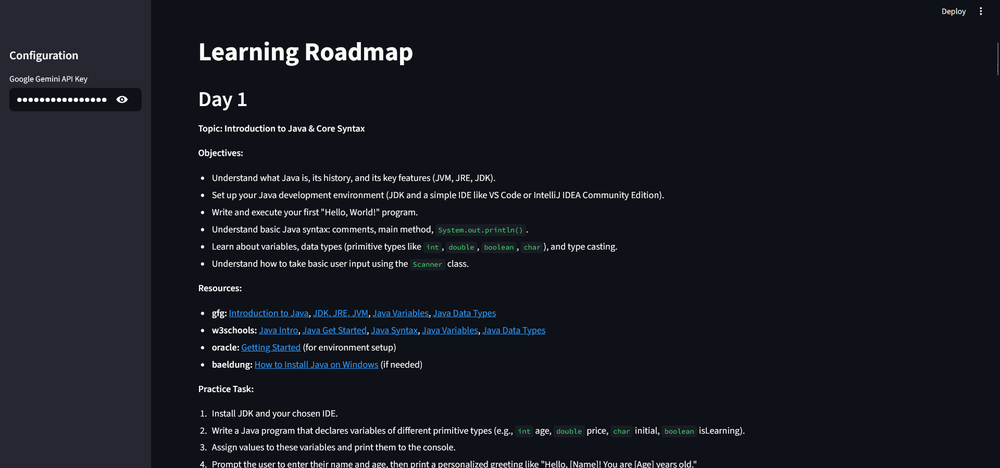

# 🚀 AI_LEARNING_PATH_GENERATOR – Personalized Learning Roadmap Generator

SkillPath AI is an AI-powered learning roadmap generator that helps users create structured, day-wise learning plans for any skill or technology.

Simply enter your learning goal, and SkillPath AI generates a personalized roadmap including:

- 📚 Daily learning topics
- 🎯 Learning objectives
- 🔗 Recommended learning resources
- 💻 Practice tasks
- 🛠️ Mini-project suggestions
- 🚀 Final capstone project

Built using Streamlit and Google's Gemini AI.

---

## ✨ Features

- Generate personalized learning roadmaps
- Day-wise structured learning plans
- Curated resource recommendations
- Practice tasks for hands-on learning
- Mini-project suggestions
- Final capstone project guidance
- Simple and interactive UI

---

## 🛠️ Tech Stack

- Python
- Streamlit
- Google Gemini API
- LangChain Google GenAI

---

## 📂 Project Structure

```text
SkillPath_AI/
│
├── app.py
├── utils.py
├── resources.py
├── requirements.txt
└── README.md
```

---

## 🚀 Installation

### Clone the Repository

```bash
git clone <repository-url>
cd SkillPath_AI
```

### Install Dependencies

```bash
pip install -r requirements.txt
```

### Run the Application

```bash
streamlit run app.py
```

---

## 🔑 Get Gemini API Key

1. Visit Google AI Studio
2. Create an API Key
3. Copy the key
4. Paste it into the application's sidebar

---

## 📸 How It Works

1. Enter your learning goal.
2. Provide your Gemini API Key.
3. Click **Generate Learning Roadmap**.
4. Receive a personalized day-wise learning plan.

Example Goal:

```text
Learn Java in 10 days
```

Example Output:

```text
Day 1
Topic: Java Basics
Objectives:
- Understand Java syntax
- Set up development environment

Resources:
- GeeksforGeeks
- Oracle Documentation

Practice Task:
Build a simple calculator

Mini Project:
Student Grade Calculator
```

---

## 🎯 Use Cases

- Learning programming languages
- Interview preparation
- Career transition roadmaps
- Skill development planning
- Student learning guidance
- Self-paced learning

---

## 🔮 Future Enhancements

- Export roadmap as PDF
- Save learning plans locally
- Progress tracking dashboard
- AI-powered quiz generation
- Personalized project recommendations
- Multi-language support

---

## 📸 Screenshots

<h3>🎯 Learning Goal Input</h3>
<p align="center">
  
</p>

<h3>🚀 Personalized Learning Plan </h3>
<p align="center">
  
</p>

<h3>📚 Generated Learning Roadmap</h3>
<p align="center">
  
</p>

## 👨‍💻 Author

Venkat Laxmi Gottam

If you found this project useful, consider giving it a ⭐ on GitHub.
